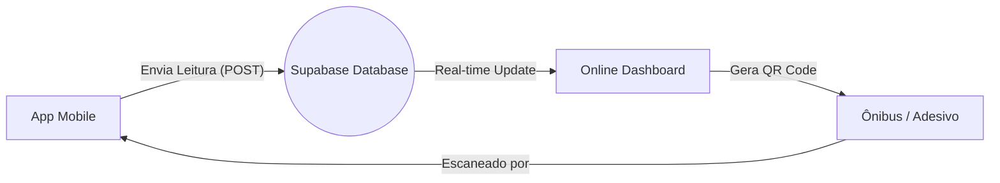

# Guia de Integração: Mobile ➔ Online (SmartBus)

Este documento explica como conectar o seu aplicativo mobile (que está na pasta `@appMobileqrCode`) ao sistema online (Dashboard), transformando os protótipos em um sistema funcional.

## 1. Arquitetura da "Ponte"
Como o Mobile e o Dashboard são projetos separados, vamos usar o **Supabase** como ponto de encontro.



## 2. Preparação do Banco de Dados
No seu console do Supabase, execute este SQL para criar a tabela de leituras:

```sql
create table readings (
  id uuid default gen_random_uuid() primary key,
  bus_plate text not null,
  driver_name text not null,
  location_lat text,
  location_lng text,
  read_at timestamp with time zone default now()
);

-- Habilitar Realtime para esta tabela
alter publication supabase_realtime add table readings;
```

## 3. Implementação no App Mobile (`@appMobileqrCode`)
Como o seu app mobile é baseado em HTML/JavaScript, você pode usar a biblioteca do Supabase via CDN.

### Adicionar o Script no `code.html`:
```html
<script src="https://cdn.jsdelivr.net/npm/@supabase/supabase-js@2"></script>
```

### Código para Enviar Dados ao Escanear:
Substitua a lógica do botão de leitura ou o sucesso do scanner por este código:

```javascript
const supabase = supabase.createClient('SUA_URL_DO_SUPABASE', 'SUA_CHAVE_ANON');

async function registrarLeitura(dadosQR) {
  // Exemplo: dadosQR = "ABC-1234|Motorista Silva"
  const [placa, motorista] = dadosQR.split('|');

  const { data, error } = await supabase
    .from('readings')
    .insert([
      { 
        bus_plate: placa, 
        driver_name: motorista,
        location_lat: "-23.5505", // Pegar do GPS do celular
        location_lng: "-46.6333"
      }
    ]);

  if (error) console.error('Erro ao enviar:', error);
  else alert('Leitura sincronizada com o painel online!');
}
```

## 4. Visualização no Dashboard Online
No seu arquivo `Dashboard.tsx` ou `Sincronizacao.tsx`, você deve substituir os dados "mock" pela escuta em tempo real:

```javascript
// Exemplo de como ouvir as batidas do celular em tempo real
useEffect(() => {
  const channel = supabase
    .channel('schema-db-changes')
    .on(
      'postgres_changes',
      { event: 'INSERT', schema: 'public', table: 'readings' },
      (payload) => {
        console.log('Nova leitura recebida do celular!', payload.new);
        // Aqui você atualiza a lista na tela automaticamente
      }
    )
    .subscribe();
}, []);
```

## 5. Próximos Passos
1. Criar uma conta gratuita no [Supabase](https://supabase.com).
2. Pegar as chaves de API.
3. Colocar as chaves no Mobile e no Dashboard.
4. O celular agora é um terminal de dados para o seu sistema online!
